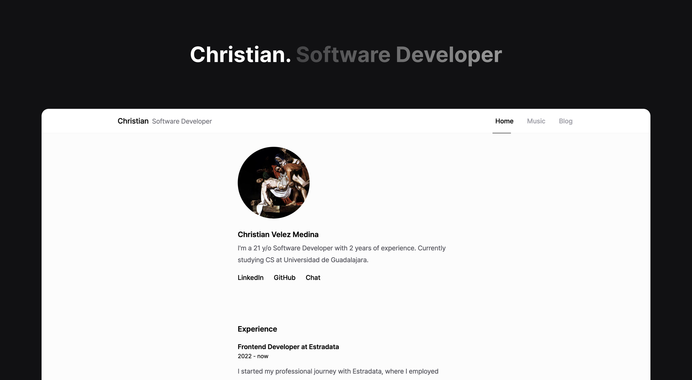

<h1 align="center">christianvm.dev</h1>

 <br />

<div align="center">

<p align="center">
    My personal website and blog.
    <br />
    <a href="https://www.christianvm.dev"><strong>Visit Demo »</strong></a>
    <br />
    <br />
</p>


</div>

<br />

### Features

-  [x] ▲ Server-Side Rendering (Next.js pages router)
-  [x] 🎧  Integration with Spotify API
-  [x] ⚡️ Supabase
-  [x] 💬 "Contact me" Chat
-  [x] 📄 MDX-based Blog

<br />

### Sitemap

```tree
├── / (Home)
│   ├── Introduction (Chat)
│   ├── Experience
│   ├── Projects
│   └── Tech Stack
│
├── /music
│   ├── Top Tracks
│   ├── Top Artists
│
└── /blog
```

<br />

### Installation

#### 1. Clone the repo

```sh
git clone https://github.com/christianvmm/christianvm.dev.git
```

#### 2. Setup .env variables

<b>NEXT_PUBLIC_SITE_URL</b> <br />
This variable should hold the URL/domain where your project is hosted. Replace the empty string with your project's URL.

<b>SPOTIFY_CLIENT_ID, SPOTIFY_CLIENT_SECRET, SPOTIFY_REFRESH_TOKEN</b> <br />
These variables are required for accessing the Spotify API. You can obtain them by registering your application on the [Spotify Developer Dashboard](https://developer.spotify.com/).

<b>NEXT_PUBLIC_SUPABASE_URL, NEXT_PUBLIC_SUPABASE_ANON_KEY</b> <br />
These variables are used to connect to the Supabase database. Obtain them by setting up a project on the [Supabase website](https://supabase.com/).

```
NEXT_PUBLIC_SITE_URL=""

SPOTIFY_CLIENT_ID=""
SPOTIFY_CLIENT_SECRET=""
SPOTIFY_REFRESH_TOKEN=""

NEXT_PUBLIC_SUPABASE_URL=""
NEXT_PUBLIC_SUPABASE_ANON_KEY=""
```

#### 3. Install NPM packages

```sh
npm install
```

#### 4. Start Next.js server

```sh
npm run dev
```
